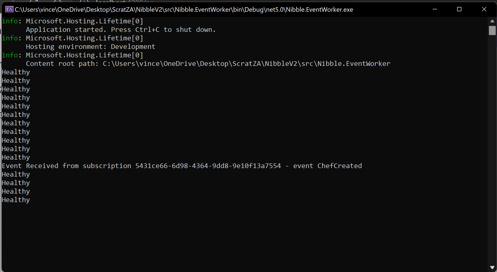

# 1. Overview

This repository contains the necessary source code to run the nibble deliver service app localy - at this point no deployment templates are included and the application has not been optimizied to run anywhere but on a local machine. 

The application itself is built using C# and Net 5 for the backends with Angular 13 on the front end (Mainly due to personal preferance). There are some useful resources that i will include for insight regarding CQRS , event sourcing and .net itself. 
- [1. Overview](#1-overview)
- [2. Application Overview](#2-application-overview)
- [3. Running the application](#3-running-the-application)
  - [3.1. Eventstore and Neo4j](#31-eventstore-and-neo4j)
  - [3.2. Web Api (Net5)](#32-web-api-net5)
  - [3.3. Front End](#33-front-end)
- [4. Sofware Architecture](#4-sofware-architecture)
  - [4.1. Backend](#41-backend)
  - [4.2. Frontend](#42-frontend)
- [5. Dependencies](#5-dependencies)

# 2. Application Overview

The application follows some basic guidelines in terms of event sourcing  - primarily I have elected to have completely seperate read and write models. All Writes (Commands) are dispatched via MediatR to handlers.
Whilst the handlers process these commands our Domain Aggregates are responsible for handling commands. This is done by associating commands with equivalent events and these events are persisted to an append only database (In this case we are using eventstore running in a docker container). This means that we are able to replay our event streams to continously recreate or rematerialize our read models. (Prior to implementing this I always thought this  event replay was a cool concept however only after seeing it in action did i understand how powerful this can be. Since context and intent is captured these systems can generate new read models on an ad hoc basis - i.e allowing new insights and building new features on the fly with little friction)

Once events are persisted there is a seperate background worker that materializes these events into views for the consumer. I decided to use Neo4j for the read models primarily because it is something ive been meaning to learn but i think it could potentially lend itself quite nicely to the problem space due to us potentially having alot of hetrogenous pieces of data. 

The query API's go directly to the database without the need for any complex business logic sitting in between. Currently the Query and Command Api's are part of the same application but i think its quite easy to see how these can be completely seperate and exist as part of their own life cycles.

# 3. Running the application
## 3.1. Eventstore and Neo4j
The application requires Eventstore and Neo4j to be running locally. There is  docker compose thats sitting here [Infrastructure/docker-compose](infrastructure/docker-compose.yaml)

run `docker-compose up` in this directory to get both databases up and running.

## 3.2. Web Api (Net5)
In order to run the application open the [Solution File](src/Nibble.sln) in Visual Studio (or whatever IDE) and make sure both Nibble.Api and Nibble.EventWorker are setup as starter projects (If u want to run the Front end aswell add Nibble as a startup project - I tend to use VSCode for anything Front end related so ill be running it from there.)

## 3.3. Front End
The frontend is a straight forward angular app in [src/Nibble](src/Nibble) run an ng serve and you should be good to go - theres a standard [README](src/Nibble/README.md) in the FE folder for more information. 

In order to check that everything is up and running. 
Run the front end and create a user 

If successful you should see a snack bar notification with the chef id 

.
In addition to the notifcation you should see an event being processed in the console for the event worker as seen below

This specific event can be found in event store aswell - navigate to [Localhost:2113](http://localhost:2113) and view the streams - there you will see our nibble stream with our chefs id appended (each chef will have their own stream). You can further drill down into the event stream and see the events associated - there our information from the front end should be seen.

Drilling into our chef stream  we can see our creation event
and the associated details 

Making a get request to the chefs endpoint should now return the chef we just created

And finally we should be able to see this chef view model in Neo4j - navigate to [Localhost:7474](http://localhost:7474) in your browser to get to the neo4j ui

# 4. Sofware Architecture
## 4.1. Backend 
//TODO
## 4.2. Frontend
//TODO
# 5. Dependencies